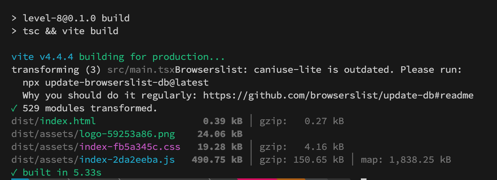
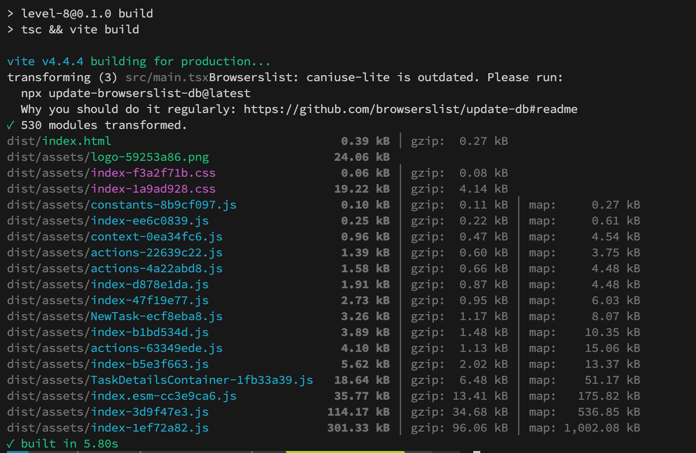
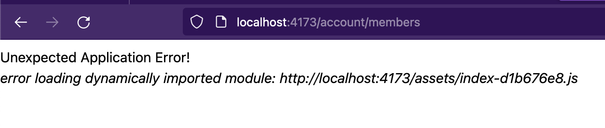

# Text

## Code Splitting

Code splitting is a technique used to improve the performance of web applications by splitting the code into smaller chunks and loading them on demand. This is particularly useful in large React applications where loading the entire codebase upfront might result in slower initial page loads.

When generating a production build, `Vite` typically consolidates all JavaScript code into a single JS file and compiles CSS into another file. Consequently, the initial page load is delayed until these files are fully downloaded. If we use `react-router` for managing different pages, there's often no need to load all components immediately; some components may only be necessary when requested.

This is the build output of `Vite` without code splitting.


React provides a native lazy loading mechanism that proves beneficial in such scenarios. By leveraging this feature, components are loaded on demand, enhancing the efficiency of the application's initial loading experience.

To split the code based on the routes, you need to import the component using `React.lazy`. Modify the content in `routes/index.tsx` as below:

```tsx
import React from "react";
import { createBrowserRouter, Navigate } from "react-router-dom";

import AccountLayout from "../layouts/account";
import ProtectedRoute from "./ProtectedRoute";

const Signin = React.lazy(() => import("../pages/signin"));
const Signup = React.lazy(() => import("../pages/signup"));
const Projects = React.lazy(() => import("../pages/projects"));
const Members = React.lazy(() => import("../pages/members"));
const Logout = React.lazy(() => import("../pages/logout"));
const ProjectDetails = React.lazy(() => import("../pages/project_details"));
const NewTask = React.lazy(() => import("../pages/tasks/NewTask"));
const TaskDetailsContainer = React.lazy(
  () => import("../pages/tasks/TaskDetailsContainer")
);
```

Here, we have wrapped all the different components within `React.lazy`. To support lazy loading, we will have to wrap the router component within `Suspense`. We have to wrap `RouterProvider` in `App.tsx` within `Suspense`.

```tsx
import { Suspense, useContext } from "react";

// ...

const App = () => {
  const { theme } = useContext(ThemeContext);
  return (
    <div
      className={`h-full w-full mx-auto py-2 ${theme === "dark" ? "dark" : ""}`}
    >
      <ProjectsProvider>
        <MembersProvider>
          <Suspense fallback={<>Loading...</>}>
            <RouterProvider router={router} />
          </Suspense>
        </MembersProvider>
      </ProjectsProvider>
    </div>
  );
};
export default App;
```

Let's take a new build.

```sh
npm run build
```

Now, you can see the entire react app is split into different files based on routes.



The initial JS file to load has decreased in size by almost 190 kB. If you look at `Network` requests made under the developer tools, you can see additional js files being loaded on demand, when browsing different routes.

This is how you improve the initial page load speed for a react application.

## Using Error boundaries

In a production environment, various issues may arise, such as the backend or API server being inaccessible, connection resets, and other unforeseen errors. Error boundaries prove valuable in handling such scenarios.. You can easily recreate such a scenario by following these steps:

1. Create a production build with code splitting.
2. Run the production build using command `npm run preview`
3. Visit the url `http://localhost:4173/` and load the React app and login to the app.
4. Take down the react server.
5. Try visiting `members` page by clicking the navigation link.

You will see such an error.



Since we are using react router, it provides an easy way to handle such cases. You can add an `ErrorBoundary` component to a parent route such as `account` route.

```tsx
  {
    path: "account",
    element: (
      <ProtectedRoute>
        <AccountLayout />
      </ProtectedRoute>
    ),
    ErrorBoundary: () => <>Failed to load the page</>,
    ...
```

Now, if you take a new production build and repeat the above steps, you will see the error has been handled.

```sh
npm run build
npm run preview
```


This pattern can be extended to any dynamically loaded components that uses `Suspense`. 

Using error boundaries in your application can provide nicer user experience.
