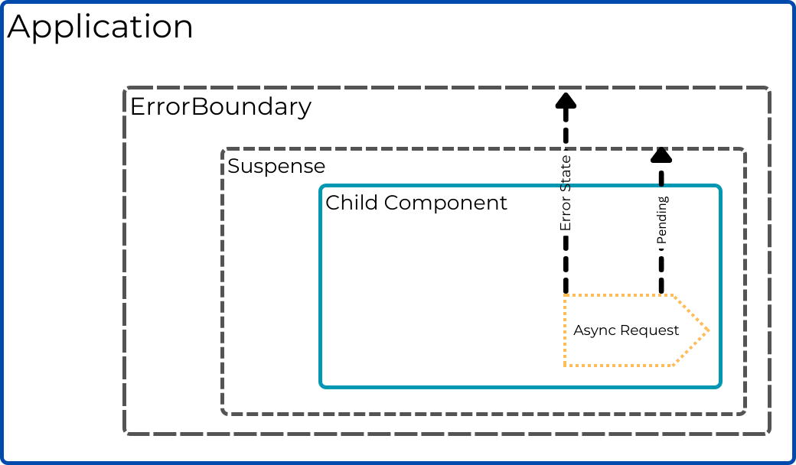

# Text

React Suspense is a React feature used to enable better handling of asynchronous operations, such as data fetching or code splitting. It allows you to suspend rendering a component while it's waiting for some asynchronous operation to complete, like loading data from an API or loading a component lazily.

Lazy loading, on the other hand, refers to the technique of deferring the loading of a component or module until it is actually needed. This can significantly improve the initial loading time of your application by splitting the code into smaller chunks and loading them only when required.

ErrorBoundary is a React component that helps catch and handle errors that occur during rendering, lifecycle methods, or in the constructor of its child components. It is used to wrap components that may throw errors, providing a fallback UI or alternative behavior when an error occurs, instead of crashing the entire application.



Suspense Boundaries in React are responsible for handling the loading states of child components. When a Suspense Boundary is encountered during rendering, it indicates that a component is waiting for some asynchronous operation, such as data fetching, to complete.

Error Boundaries in React handle errored states of child components. When an error occurs during rendering, lifecycle methods, or in the constructor of a component wrapped by an Error Boundary, the Error Boundary is triggered.

Both Error Boundaries and Suspense Boundaries utilize the same underlying JavaScript mechanism: the throw statement. JavaScript allows throwing not just errors but any type of value or object.

## Implementing Suspense and ErrorBoundary

Now let's dive into the steps for implementing React Suspense and lazy loading in our existing React application:

- Make sure your React and React DOM versions are at least 16.6 or above, as React Suspense was introduced in version 16.6. You can confirm these from your `package.json`

- Choose a component that you want to load lazily. Let us pick from the existing components that we have already created in the previous levels.

- Let us use the Projects pages and make changes to the `index.tsx` within the `pages\projects` folder, import the React library and wrap the import of the selected component in this case the `ProjectList` component with the `React.lazy` function:

```js
import React, { Suspense } from "react";
const ProjectList = React.lazy(() => import("./ProjectList"));
import NewProject from "./NewProject";
```

Here, the import('./ProjectList') syntax uses dynamic import, which allows the component to be loaded lazily.

- Next, let us update the component to be wrapped in React Suspense. The final file will look like this.

```js
import React, { Suspense } from "react";
const ProjectList = React.lazy(() => import("./ProjectList"));
import NewProject from "./NewProject";

const Projects = () => {
  return (
    <>
      <div className="flex justify-between">
        <h2 className="text-2xl font-medium tracking-tight text-slate-700">
          Projects
        </h2>
        <NewProject />
      </div>
      <Suspense fallback={<div className="suspense-loading">Loading...</div>}>
        <ProjectList />
      </Suspense>
    </>
  );
};

export default Projects;
```

- You can also create a Error catching mechanism using an ErrorBoundary component for any component loading issues.

- Add a new folder within the `src` called `components`. Create a new file called `ErrorBoundary.tsx` inside it to define your `ErrorBoundary` component:

```js
import React, { Component, ErrorInfo, ReactNode } from "react";

interface ErrorBoundaryState {
  hasError: boolean;
}

class ErrorBoundary extends Component<{}, ErrorBoundaryState> {
  constructor(props: {}) {
    super(props);
    this.state = { hasError: false };
  }

  static getDerivedStateFromError(error: Error): ErrorBoundaryState {
    return { hasError: true };
  }

  componentDidCatch(error: Error, errorInfo: ErrorInfo): void {
    // You can log the error or send it to an error reporting service
    console.error("ErrorBoundary caught an error:", error, errorInfo);
  }

  render(): ReactNode {
    if (this.state.hasError) {
      return <div>Something went wrong.</div>;
    }

    return this.props.children;
  }
}

export default ErrorBoundary;
```

The `ErrorBoundary` component will catch any errors thrown by its children components.

- Wrap the component that uses the selected component inside the <Suspense> component and the <ErrorBoundary> component. The <Suspense> component takes a fallback prop, which is content to be rendered while the lazy component is loading. The <ErrorBoundary> component will catch any errors that occur within its children components. The final updated `index.tsx` for `projects` will be as below.

```js
import React, { Suspense } from "react";
const ProjectList = React.lazy(() => import("./ProjectList"));
import NewProject from "./NewProject";
import ErrorBoundary from "../../components/ErrorBoundary";

const Projects = () => {
return (
<>
<div className="flex justify-between">
<h2 className="text-2xl font-medium tracking-tight text-slate-700">
Projects
</h2>
<NewProject />
</div>
<ErrorBoundary>
<Suspense fallback={<div className="suspense-loading">Loading...</div>}>
<ProjectList />
</Suspense>
</ErrorBoundary>
);
};

export default Projects;
```

In this example, if an error occurs within the `ProjectList`, it will be caught by the `ErrorBoundary` and render the "Something went wrong." message.

- Just for testing this, try adding the below code in `ProjectListItems.tsx` file.

```js
if (projects.length === 0) {
  throw Error("Error!!!");
}
```

- The above code when on the application will throw an Error Message as `"Something went wrong."` only within the component and that error will not propagate beyond that, breaking the application.

- You can create separate Error scenarios such as this for all the API failure cases and add ErrorBoundary checks for the same by throwing an error from the child component.

- Revert the above change before continuing.

- Now, build and run the React application as we normally would. The `ProjectList` will be loaded lazily when required, and any errors that occur within the component will be caught by the `ErrorBoundary`.

With lazy loading, your application can dynamically load components only when needed, reducing the initial bundle size and improving the overall performance. React Suspense simplifies handling asynchronous operations and provides a clean way to suspend rendering until the required data or component is ready.

With the above changes, we have successfully configured React Suspense and lazy loading in our Application. By combining Error Boundaries and Suspense Boundaries, you can create a robust and stable user interface that gracefully handles loading states, error states, and normal states. These features work together to enhance the overall user experience and provide a more reliable and error-tolerant application.

See you in the next one!!!
