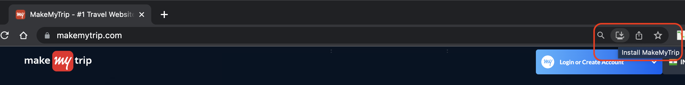

# Text

Progressive Web Apps (PWAs) are a modern approach to building web applications that provide a native app-like experience to users. PWAs combine the best features of both web and mobile applications, offering a reliable, fast, and engaging user experience.

Unlike traditional web apps, PWAs can be installed on a user's device and accessed directly from the home screen, just like a native app. They are built using web technologies such as HTML, CSS, and JavaScript but leverage service workers, caching, and other modern APIs to provide advanced features.

You can read more about this [here](https://developer.mozilla.org/en-US/docs/Web/Progressive_web_apps/Guides/What_is_a_progressive_web_app)

Let us check out an existing PWA you might be using regularly but might have missed noticing.

Try visiting [MakeMyTrip](https://www.makemytrip.com/) which is a thoroughly progressive web app. When you are on the page on a Chrome web browser in the URL bar, you can see the below option to Install the app. While the application is not actually downloaded, this creates a Browser wrapper, particularly for the Webpage you are viewing, and provides you with a Native experience similar to any installed application in your Operating system.



Making a web application into a PWA offers several benefits:

1. Offline Functionality: One of the key advantages of PWAs is the ability to work offline or in unreliable network conditions. PWAs can cache essential assets and content, enabling users to access and interact with the app even without an internet connection.

2. Improved Performance: PWAs are designed to be fast and responsive. They utilize techniques like pre-caching, lazy loading, and smart resource fetching to deliver a smooth user experience, reducing loading times and enhancing performance.

3. App-like Experience: PWAs can be installed on a user's device, providing a home screen icon and a full-screen experience. They can also send push notifications, utilize device hardware (e.g., camera, geolocation), and be accessed with a single tap, making them feel like native apps.

4. Cross-platform Compatibility: PWAs are platform-agnostic and can run on various devices, including desktops, smartphones, and tablets. They eliminate the need for separate development for different platforms, reducing time and cost.

5. Discoverability and Engagement: PWAs are easily discoverable through search engines, making it easier for users to find and access your application. Additionally, by utilizing push notifications, you can engage with your users and provide real-time updates, enhancing user engagement and retention.

6. Simplified Updates: With PWAs, you can deliver updates seamlessly without requiring users to download and install them manually. The service worker technology enables automatic updates, ensuring that users always have the latest version of your application.

## Ways to test a PWA

To test if a web application is a Progressive Web App (PWA), you can follow these steps:

1. Use Lighthouse Audit: Lighthouse is a powerful auditing tool built into Google Chrome's Developer Tools. Open your web application in Chrome, then right-click on the page and select "Inspect" to open the Developer Tools panel. Navigate to the "Audits" tab and click on "Perform an audit". Ensure that "Progressive Web App" is selected and click "Run audits". Lighthouse will analyze your application and provide a detailed report with PWA-specific criteria, including whether your app meets the PWA requirements.

2. Check for Service Worker: PWAs utilize service workers, which are JavaScript files responsible for caching assets, enabling offline functionality, and handling push notifications. Open the Developer Tools panel in Chrome, go to the "Application" tab, and check if there is a "Service Workers" section. If a service worker is registered for your application, it indicates that your app has the potential to be a PWA.

3. Test Offline Functionality: A key characteristic of PWAs is their ability to work offline. Disconnect your device from the internet or use the "Offline" option in Chrome's Developer Tools to simulate an offline environment. Load your web application and verify that it still functions correctly and displays relevant content even without an internet connection.

4. Install on Device: PWAs can be installed on users' devices, providing a native-like experience. Open your web application in Chrome, click on the browser's menu (usually represented by three dots) and look for an "Install" or "Add to Home screen" option. If the option is available, click on it to install the PWA on your device. Check if the app is added to your home screen, launches in full-screen mode, and behaves like a standalone application.

5. Test Push Notifications: PWAs can send push notifications to engage users with timely updates. Ensure that your application has implemented push notification functionality and test whether notifications are received and displayed correctly when triggered.

By following these steps, you can effectively test if your web application meets the criteria of a Progressive Web App and verify its offline capabilities, installation behavior, and push notification functionality.

## Configuring Vite-based React application as PWA

Now, let us learn how to configure an existing Vite-based React application to be a Progressive Web App (PWA):

**1. Install the Vite PWA plugin**

The first step is to install the Vite PWA plugin. You can do this by running the following command within your application folder:

```
npm install vite-plugin-pwa
```

**2. Add the PWA plugin to your Vite configuration file**

Once you have installed the Vite PWA plugin, you need to add it to your Vite configuration file. This file is called `vite.config.js` and it is located in the root directory of your project.

To add the PWA plugin to your Vite configuration file, open the file and add the following line:

```js
import vitePWA from "vite-plugin-pwa";

export default defineConfig({
  plugins: [vitePWA()],
});
```

**3. Create a Web App Manifest file**

The next step is to create a Web App Manifest file. This file is a JSON file that contains information about your PWA, such as its name, icon, and start page.

To create a Web App Manifest file, in the root folder of our application create a new file called `manifest.webmanifest`. In this file, add the following code:

```
{
"name": "Smarter Tasks application",
"short_name": "Smarter Tasks",
"icons": [
{
"src": "/favicon.ico",
"sizes": "16x16 32x32 64x64 128x128"
},
{
"src": "/android-chrome-192x192.png",
"sizes": "192x192"
},
{
"src": "/android-chrome-512x512.png",
"sizes": "512x512"
}
],
"start_url": "/index.html"
}
```

You can use tools like [PWABuilder](https://www.pwabuilder.com/imageGenerator) to generate the images as per your choice for the above file configuration. These images are used as Icon files when you get to install them in your system.

**4. Register the service worker**

The final step is to register the service worker. This is done by adding the following code to the `head` section of your `index.html` file in the application root folder:

```js
<script>navigator.serviceWorker.register('/sw.js');</script>
```

Once you have completed these steps, your React application will be a PWA. You can test this by opening your application in a browser and clicking on the `Add to Home Screen` button, or through the Lighthouse Audit in Chrome console.

Now, that we have successfully configured our application as a PWA, we can use it similar to a native application from our operating system. See you in the next one!
