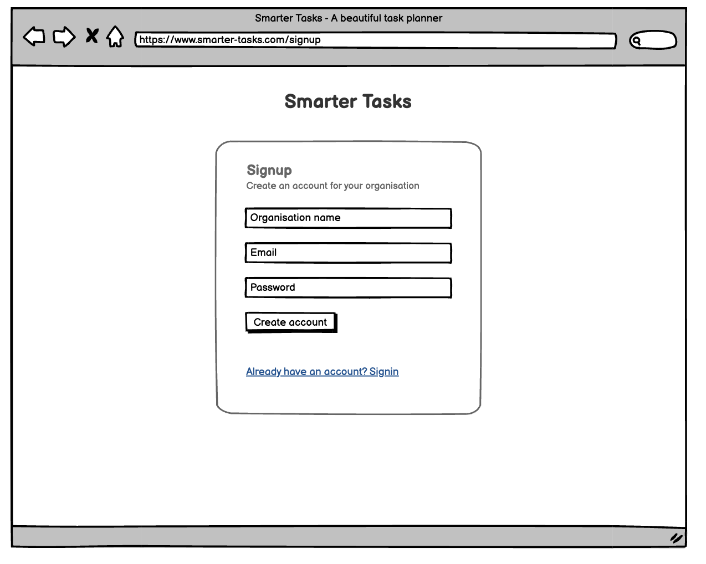
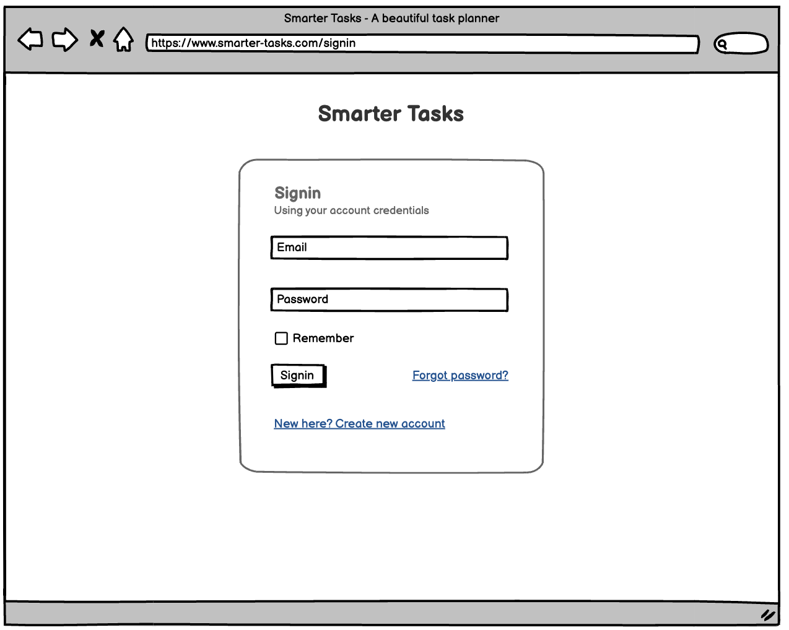
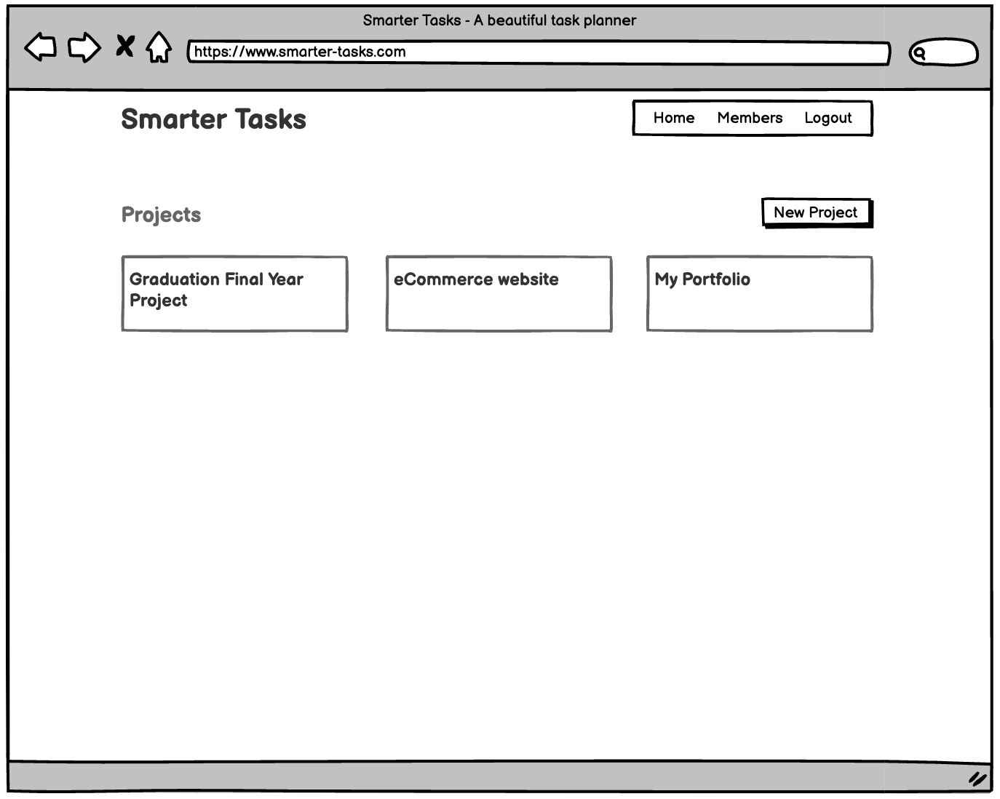
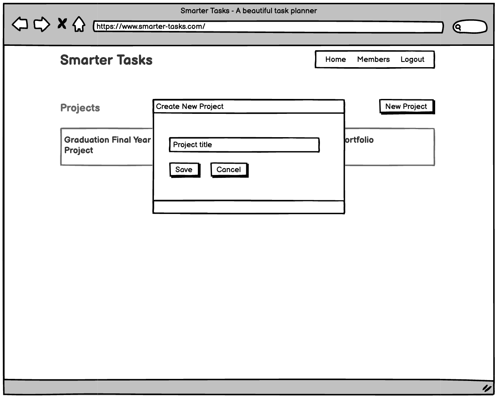
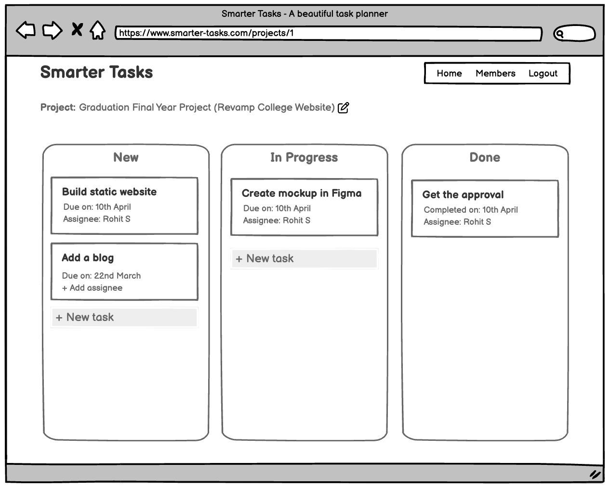
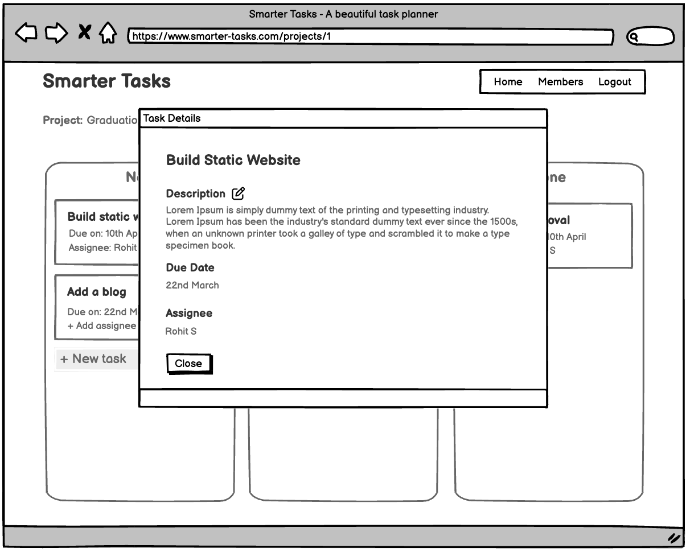

# Text
Hello and welcome to this new lesson, here I will walk you through the wireframe of the application, that we're going to build over next the few lessons. And then I'll also explain the API service that we've created for you, to easily integrate with React. We don't want you create API endpoints at the moment, as your focus should be on React, right? 

So, let's get started!

# Script

### The application
From this lesson onwards, we are going to upgrade our Smarter Tasks application, and we are going to build a **Project Management System**.

#### What is a project management system?
A project management system is a software or platform designed to help plan, organize, and track tasks and resources needed to complete a project from start to finish. It typically includes features for project listing, task management, resource allocation, communication tools for team collaboration. The system is used to streamline project workflows, improve team productivity, and ensure project goals are met within the specified time. A project management system may also provide reporting and analytics capabilities to enable project managers to monitor progress and make data-driven decisions.

#### Features that we will build
So, throughout the next few lessons, we will build some essential features of a Project management system, like:
- Signing up as an organisation
- Inviting other members to join
- Creating projects
- Listing open tasks for a project
- Assigning tasks to different members
- Managing state of tasks (Ex. New, In progress, Done etc.)
- Allow users to comment on tasks for better communication and collaboration
- Tracking all activities of different projects

Along with that, a project management system should have a **reports and analytics** section, but for now we are not keeping it as part of our implementation. Though you can work on it on your own, to improvise the PMS further.

### The wireframe
So, let me show you the wireframe of different pages:
> Action show the wireframes

First, we have a signup page, where organisation owner/admin can create a new account.

Then comes the signin page to login to your account.

After signup/signin, you will be able to see, the list of all projects. There you'll get an option to create a new project.

Then, if you would go inside a project, you'll be able to see, the list of all tasks grouped into three categories, i) new, ii) in progress, iii) done. These categories are nothing but three states of a task.
In these lists, you are free to add new task anywhere. You should be able to drag-and-drop a task from one category to another. 

And once you'll click on a task card, you should be able to see its details in a dialog.

In that dialog, the user should be able to edit the task title, description, due date and assignee name, using a feature called *in-place editing*.

After these basic task details, the user should get an option to add comment for that task. And just below that, he/she should be able to see the list of all comments.

Then from the main menu, the user should be able to visit and see the list of all members in that organisation, and he/she can invite others to join as well.

### Understanding the API service
Now, to implement all these features, we need a lot of APIs. 

API is nothing but a set of protocols, tools, and routines that enable software applications to communicate with each other. In simple terms, an API acts as an intermediary between different software applications, allowing them to share data and functionalities with each other.

So, from our React app, we have to make API calls to a API service provider to implement all these features. And we have to deal with a lot of endpoints. But, don't worry, we've created each and every API endpoints required for this project, and it's deployed at: `https://wd301-api.pupilfirst.school`
> Action: Show the API endpoint URL

And you can see the complete documentation for all API endpoints from here:
https://github.com/pupilfirst/smart-tasks-api/blob/main/public/smarter-tasks-openapi.yaml
> Action: Open the API-doc in HTML format.

Let me explain the endpoints one by one:

So, as you can see, we've categorised all API endpoints into four groups: *Organisation*, *Users*, *Projects* and *Tasks*.

In the **Organisation** group, we've only one endpoint to:
1. Create an organisation

In the **Users** group, we've endpoints to:
1. Create a new user
2. Get user details by his/her ID
3. Update user details by his/her ID
4. Get list of all users
5. Signin to account

In the **Projects** group, we've endpoints to:
1. Create a new project
2. Get project details by it's ID
3. Update a project
4. Get list of all projects

And finally, in the **Tasks** group, we've endpoints to:
1. Add a new task
2. Update a task
3. Delete a task
4. Get list of all tasks
5. Add a new comment against a task
6. Get the list of all comments made against a task

So, please go through the API doc, on your own. There you'll notice, we've added a lot of details in terms of, what are the parameters, which ones are required, sample request body, sample response body and all possible HTTP status codes you might encounter based on client or server errors.

Now, most of these endpoints are secured, except the endpoints for *creating new organisation* and *user signin*. We've secured all ciritical resources or endpoints, so that we can prevent them from unauthorised access. So, in all of these secured endpoints, you've to send a token as part of a request header called **Authorization**. You'll get the token once you would signin to the application. In our React app, we've to make sure to store that token in the browser and send it as part of the  **Authorization** header, to call the protected endpoints.

So, that was a quick introduction of our PMS project, it's wireframe and the API service. 

Are you excited to consume all these endpoints to create an awesome React app?

Yes!

See you in the next video.

