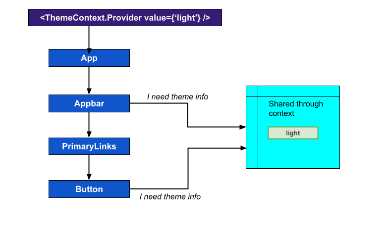
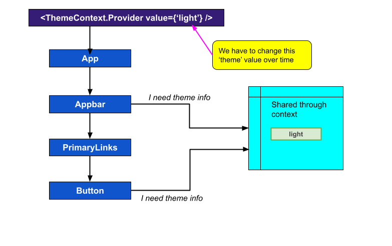
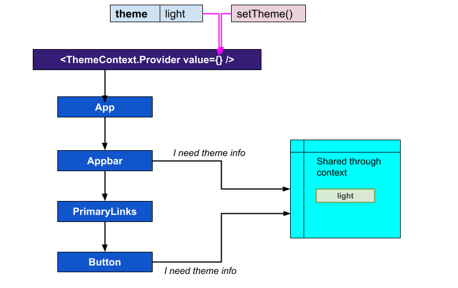
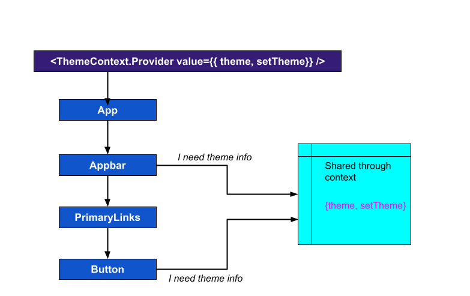

# Script
So far, we've created the context object and using the provider we've shared the same information to the child components.


So, because we've provided 'light' as the value in the Provider, our context object is going to store the string **'light'** and any component can reach out to the context object and get access to that value.

The downside to our current application is that the string **'light'** is static and fixed. It doesn't change over time, and that's really not very useful. We need to somehow modify that value.

And of course, any time we modify that value, we probably want to make sure that any component that relies upon the value, such as **Appbar**, gets automatically rendered so it can show that new content on the screen.

And yeah.

Does any of this sound kind of familiar?

Let me re-iterate this once again:

We have some data inside of our app, and it's going to change over time. Whenever it changes, we want to re-render our content on the screen. And so that's a sign to us that we probably want to use some **state**.

So here's the idea. Whatever we put as **value** in `ThemeProvider`, we have to change it over time.


Here I want to give it a variable name, say `theme`. So we want to have some kind of `theme` piece of state that is going to change over time. And somehow we've to define a function that can change the `theme` value. We can name that function as `setTheme()`. 


And in Provider, instead of passing just the simple string, like **'light'** or **'dark'**, we've to pass both the `theme` variable and `setTheme()` function. So we can pass it as an object, like this:


So now the rest of our application, can receive this object, that has the `theme` piece of state, and a function i.e. `setTheme()`, to change it over time.

So now any component, can reach out to our context, get access to the current `theme` and a function to change it very easily.

And in order to implement that, we will create a new Custom Provider component. So, lets get started.

### Step 1: Creating a custom provider
In this step, we are going to update our existing ThemeContext (i.e the src/context/theme.ts file), to define the custom provider. And this Provider would be nothing but a simple React component.

```tsx
import React, { createContext, useState } from "react";
const ThemeContext = createContext('light')

const ThemeProvider: React.FC<React.PropsWithChildren> = ({ children }) => {
  const [theme, setTheme] = useState('light');

  const valueToShare = {
    theme: theme,
    setTheme: setTheme
  };

  return (
    <ThemeContext.Provider value={valueToShare}>
      {children}
    </ThemeContext.Provider>
  );
};

export { ThemeContext, ThemeProvider };
```
So, here 
- we've imported the `useState` hook, as I mentioned earlier that we've to deal with some state management.
- then we've defined the new component called `ThemeProvider`, and there are accessing the `children` property from props.
- after that we are using the `useState` hook to define a simple state called `theme`, with default value set to 'light'.
- then I've defined a const called `valueToShare`, means the values that we would like to share through context. Now for the sake of understanding I've kept this simple name, though you can change it based on your need. Now, we've defined the `valueToShare` const as a simple JS object, which has two properties, `theme` and `setTheme`. So here we are passing the `theme`, and the `setTheme` function to change the state or theme value.
- Now we can share the `valueToShare` object with the rest of our application.
- Then comes the important part, where we're returning the `<ThemeContext.Provider>` with value set to `valueToShare`. And then we are wrapping the `{children}` with the `<ThemeContext.Provider>`. 
- So are you getting the point? The code we've written in our `src/index.tsx` file, means where we've wrapped our App component with `<ThemeContext.Provider>`, we've now moved that piece of code here.
- And finally we are exporting both `ThemeContext` and `ThemeProvider` from this file.
  
Now as we are writing JSX code here, so we've to update the filename as well. We've to rename it as `theme.tsx`, instead of `theme.ts`.

Then, we've to fix the default value in the `createContext()`. We've to change it from a simple string to an object.
```tsx
interface ThemeContextProps {
  theme: string;
  setTheme: (color: string) => void;
}

const ThemeContext = createContext<ThemeContextProps>({
  theme: 'light',
  setTheme: () => {}
});
```
So the default value object now have two properties: `theme` which is a string and `setTheme` which is a function. To make it TypeScript compatible, I've also defined an interface called `ThemeContextProps` to define the type of properties in this object.

So, our step 1 is complete and we've successfully defined the custom provider.
> This is the complete file
```tsx
// src/context/theme.tsx
import React, { createContext, useState } from "react";

interface ThemeContextProps {
  theme: string;
  setTheme: (color: string) => void;
}

const ThemeContext = createContext<ThemeContextProps>({
  theme: 'light',
  setTheme: () => {}
});

const ThemeProvider: React.FC<React.PropsWithChildren> = ({ children }) => {
  const [theme, setTheme] = useState('light');

  const valueToShare = {
    theme,
    setTheme
  };

  return (
    <ThemeContext.Provider value={valueToShare}>
      {children}
    </ThemeContext.Provider>
  );
};

export { ThemeContext, ThemeProvider };
```

### Step 2: Importing the custom provider
Next, we've to update the `src/index.tsx` file to import and use our custom provider.
```tsx
import React from 'react';
import ReactDOM from 'react-dom/client';
import './index.css';
import App from './App';
import reportWebVitals from './reportWebVitals';
import { ThemeProvider } from "./context/theme";

const root = ReactDOM.createRoot(
  document.getElementById('root') as HTMLElement
);
root.render(
  <ThemeProvider>
    <App />
  </ThemeProvider>,
);

reportWebVitals();
```
So, here we've just simply replaced the `<ThemeContext.Provider>` with `<ThemeProvider>`. And the App component is being placed in between the `<ThemeProvider>` tags. Now the `App` component is going to show up as a prop to our `ThemeProvider` called `children` (*Action: Show ThemeProvider component and highlight the children part*). So, that's kind of how the `children` thing fits in, inside the `ThemeProvider`.

### Step 3: Update the places where we were consuming the context value
Now at this moment if we would open the browser, you would see some errors in App component. And that's perfectly fine as we've to update the code there and change the way of accessing the `ThemeContext` value.
```tsx
import React, { useContext } from "react";
import { RouterProvider } from "react-router-dom";
import "./App.css";
import router from "./routes"
import { ThemeContext } from "./context/theme";

const App = () => {
  const currentTheme = useContext(ThemeContext)
  return (
    <div>
      {currentTheme.theme}
      <RouterProvider router={router} />
    </div>
  );
}
export default App;
```
So here,
- First, I've updated the import statement : `import { ThemeContext } from "./context/theme"`
- Then in the return statement, instead of `currentTheme`, I'm printing the `currentTheme.theme` to get the actual theme value from context.

### Step 4: Implementing a theme toggle switch
Now finally we are all set to change the context value from a child component. And we will do that from our `Appbar` component. So the plan is, in our app's navbar or appbar, we will create a toggle switch to enable or disable dark mode.
```tsx
// /src/layouts/account/Appbar.tsx
import { useState, Fragment } from 'react'
import { Disclosure, Menu, Transition, Switch } from '@headlessui/react'
// ...
// ...
const Appbar = () => {
  const [enabled, setEnabled] = useState(false)
  // ...
  // ...
  return (
    <>
      ...
      ...
          <Switch
            checked={enabled}
            onChange={setEnabled}
            className={`${enabled ? 'bg-slate-400' : 'bg-slate-700'}
              relative inline-flex h-[24px] w-[60px] shrink-0 cursor-pointer rounded-full border-2 border-transparent transition-colors duration-200 ease-in-out focus:outline-none focus-visible:ring-2  focus-visible:ring-white focus-visible:ring-opacity-75`}
          >
            <span className="sr-only">Use setting</span>
            <span
              aria-hidden="true"
              className={`${enabled ? 'translate-x-9' : 'translate-x-0'}
                pointer-events-none inline-block h-[20px] w-[20px] transform rounded-full bg-white shadow-lg ring-0 transition duration-200 ease-in-out`}
            />
          </Switch>
          <Menu as="div" className="relative ml-3">
            <div>
              <Menu.Button className="rounded-full bg-white p-1 text-gray-400 hover:text-blue-600">
                <UserCircleIcon className="h-6 w-6" aria-hidden="true" />
              </Menu.Button>
            </div>
            ...
            ...
          </Menu>
      ...
      ...
    </>
  );
}
// ...
```
So here,
- First I've imported the `useState` hook from React
- Then I've imported the [Switch from @headlessui/react](https://headlessui.com/react/switch): `import { Disclosure, Menu, Transition, Switch } from '@headlessui/react'`
- After that I've defined a simple state called `enabled` to toggle the switch: `const [enabled, setEnabled] = useState(false)`.
- And finally I just copied the complete JSX code of a very basic Switch, from the [headlessUI website](https://headlessui.com/react/switch).

Now let's go back to the browser to check if the toggle switch is working or not.
> Open localhost:3000 to check if the toggle switch is coming or not.

So, yes the switch is coming properly and I can toggle the button.

### Step 5: Changing the context value from Appbar component
Now we are all set to integrate the theme toggle switch with our ThemeContext. So the plan is, we will import the ThemeContext in Appbar component, and then we will use the `setTheme` method to change the context value, on theme toggle switch change event. So, let's get started.

First, I'll import the context:
```tsx
// /src/layouts/account/Appbar.tsx
import { useState, useContext, Fragment } from 'react'
...
...
import { ThemeContext } from "../../context/theme";
...
...
const Appbar = () => {
  ...
  const { theme, setTheme } = useContext(ThemeContext)
  const [enabled, setEnabled] = useState(theme === 'dark')
}
```
Here,
- I've imported the ThemeContext, and using the `useContext` hook, I've gained access to the `theme` property and `setTheme` function.
- Then based on the value of `theme`, I've decided the initial or default value of `enabled`.

Next, we've to get the `onChange` event of the Switch, and then we've to call the `setTheme` function to change the context value. For that, we will implement a `toggleTheme` function, and then we will attach it with the `onChange` method of Switch.
```tsx
  const { theme, setTheme } = useContext(ThemeContext)
  const [enabled, setEnabled] = useState(theme === 'dark')

  const toggleTheme = () => {
    let newTheme = ''
    if (theme === 'light') {
      newTheme = 'dark'
    } else {
      newTheme = 'light'
    }
    setEnabled(!enabled)
    setTheme(newTheme)
  }

  return (
    ...
    ...
      <Switch
        checked={enabled}
        onChange={toggleTheme}
        className={`${enabled ? 'bg-slate-400' : 'bg-slate-700'}
          relative inline-flex h-[24px] w-[60px] shrink-0 cursor-pointer rounded-full border-2 border-transparent transition-colors duration-200 ease-in-out focus:outline-none focus-visible:ring-2  focus-visible:ring-white focus-visible:ring-opacity-75`}
      >
        ...
        ...
      </Switch>
    ...
    ...
  )
```

Now let's go to the browser to check if it's working or not
> Open localhost:3000 to check if the toggle switch is working or not. On toggle it will change the context value. We've printed current theme value in App component, so that value should change accordingly.

Hey, it actually works!

So, let me explain what is happening once again:
- Whenever a user clicks on that Switch, our Appbar component is going to call `setTheme` function.
- The `setTheme` function updates the `theme` state of the `ThemeProvider` component.
- As we are updating state, our ThemeProvider component is going to re-render, along with all of it's `children`, like the  `App` component, `Appbar` component etc. And that's how the App and Appbar component gets the new value from context.
  
So, that's the entire flow.

Now one last thing is pending, that is we've to somehow tell our components to change it's color based on the value of `theme`.

### Step 6: Completing the theme implementation
Now, as per [TailwindCSS](https://tailwindcss.com/docs/dark-mode#toggling-dark-mode-manually), to toggle dark mode manually, we've to use the `class` strategy. So, we will update the tailwind config like this:
```js
// tailwind.config.js
/** @type {import('tailwindcss').Config} */
module.exports = {
  content: [
    "./src/**/*.{js,jsx,ts,tsx}",
  ],
  theme: {
    extend: {},
  },
  plugins: [],
  darkMode: "class"
}
```

Next, I'll update the App.css file, and add the default background and text color for dark mode:
```css
.dark {
  @apply bg-slate-800 text-zinc-50;
}
```

And that's it. Let's go back to the browser to check if it's working or not
> Open localhost:3000 to check if the toggle switch is working or not
And yes! it's working as expected. So finally, our theme switcher is working as expected.

So, that's all for this lesson, see you in the next one.