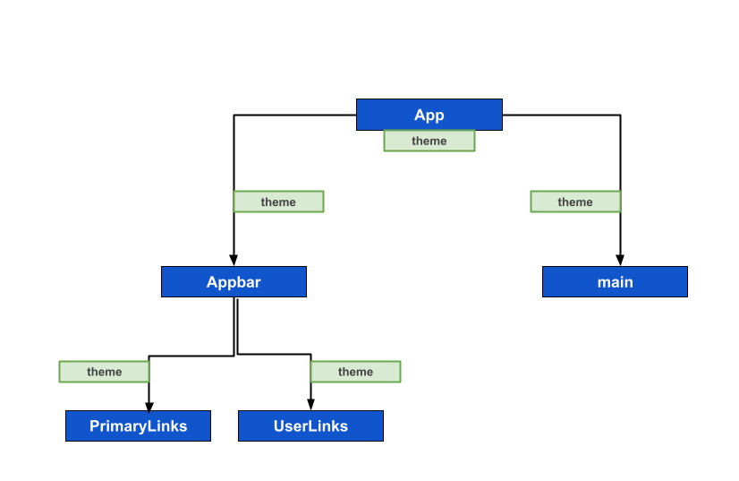
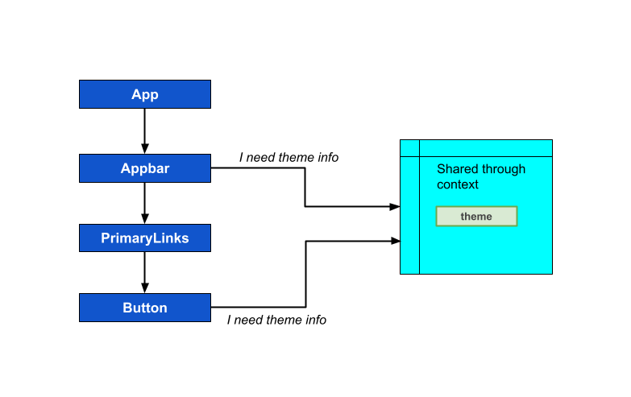
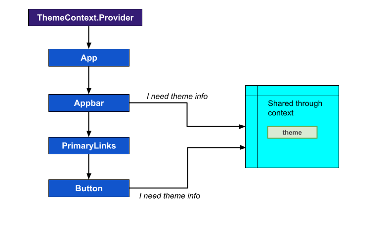

# Script
In this lesson, we are going to learn about an interesting concept in React, called **context**. 

To understand it better, we will start with a problem statement, from our `Smarter Tasks` apps's point of view.

In our app, we currently have a `App` component, and inside the App component we have the `Appbar` component and a `main` element to render other child components. Now let's say if we would like to implement a dark mode - light mode theme switcher, then we have to keep the currently active theme value in the App component, and pass down the same information to the child components as **props**, right? 



So, as shown in the image, we have to pass the `theme` props from App component to the `Appbar` component, then the same props needs to be passed to the `PrimaryLinks`, or `UserLinks` component. And that is only one side of component tree, on the another side, where we've the `main` container, there more child components will come in future, where we have to show UI elements like: lists, tables, forms, buttons etc. And can you imagine, in that case we've to pass down the *theme* information as props to multiple layers of child components. And there is nothing wrong with that, but it's tedeaous job.

So, to help with this kind of situation, React introduced a concept called Context, using which we can share information or data in the form of numbers, strings, arrays and so on, or functions across different levels components inside of our application. Context is kind of like an alternative to the props system. Props is all about communication between a parent and an immediate child.

But with the contact system, we can share data across many different components, even if they don't have a direct link to each other.



So our context might share some data in the form of a number, a string, an array or so on, or even more complex things like an object. Once we share this data, our different components can then reach out to this context and ask for any particular pieces of data.

For example, the `Appbar` component or the `Button` component could ask for the *theme* information.

But, at this point, one thing I want to make super clear is that, **Context is not a replacement for props.** 

So the idea is, we are going to share some amount of data through context and we will still  make use of props for customizing individual components. So it is not a total replacement for the *props system*.

To use context in a React app, we have to follow three simple steps:
1. Step 1: Create the context
2. Step 2: Specify the data that will be shared
3. Step 3: **Consume** the data in a component

### Step 1: Creating the context
So first step is very easy. To create our context, we'll usually make a new file, and then inside that file we will import a function from React called `createContext()`.
```tsx
import { createContext } from 'react';

const ThemeContext = createContext()
```
So, here we simply called `createContext`, and we got something back called the context object. So in our case, we will call it as `ThemeContext`. This object has two properties inside of it:
- The first property is called **Provider**.
- And the second is called **Consumer**.

These are both React components. The **Consumer** is not used very often, so we're not going to worry about it too much. The **Provider** is a React component that we use to specify what data we are trying to share with the rest of our application.

To render this **Provider** component somewhere inside of our application we would write out something like:
```tsx
<ThemeContext.Provider>
  ...
  ...
</ThemeContext.Provider>
```
Okay, so that's step one, just to create the context.

### Step 2: Setting the value
So now in step two, we have to specify the data that we are going to share.
```tsx
<ThemeContext.Provider value='dark'>
  <Appbar />
</ThemeContext.Provider>
```
So here, to specify the data that I want to share, we're going to give that provider a `value` prop.
This `value` prop is very special. As whatever you provide to that `value` prop, is the information that you're going to share with the rest of your application.

In our case, I've said that we want to share the value `dark` across all of our different components. And that's pretty much it.

The `value` we pass in here, there can be any type of value. So it can be a simple number, it can be a string, it can be an array of strings, it can be an object with a bunch of different functions and nested data on it. 

Now, the critical part is to specify which components are going to receive this value or have access to it. We have to put those components inside of the **provider**.

So by putting in, say, `<Appbar />` right there, we are specifying that that the `Appbar` component can now access the value that is being shared in the context, which in this case is the string `dark`.


Now that part is the super, super critical part. In order to create a context like, `ThemeContext`, we will  create that `provider` thing as a new component, and then we will let it to the rest of our application.



And as as are setting the value prop at the top level of component hierarchy, it will be accessible throughout all of our different components.

Okay, So now move forward to the step number three.

### Step 3: Consume the data
In this step, we're going to consume the data from a component and use it in some way. This is also just a little bit complicated, but mostly just because it involves a lot of code.

In order to access the context data in a component, we will import a function from React called `useContext`.
```tsx
import { useContext } from 'react'
import ThemeContext from "./ThemeContext"

const Appbar = () => {
  const currentTheme = useContext(ThemeContext)
  return (
    <div>{currentTheme}</div>
  )
}
```
As you can see, here we've also imported the context object we've created during step one. Then inside of our component function, we're going to call, use context and pass in our entire context object.

That's going to give us back whatever we had put in to the `value` prop during step two.
Then I'm simply printing the `currentTheme` value, inside a `div`. And so in this case `currentTheme` would be **dark** because in step two we've passed it as value prop.

So, that was a quick introduction to the context system and this is just the beginning, as there's even more complex stuff present on this topic that we will learn gradually.

So, we are all set to code our first Context implementation, see you in the next lesson.