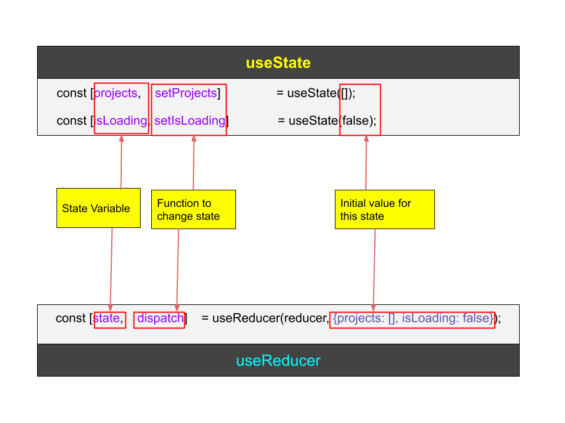

# Text
In previous lessons, you've already learned about the most used React hooks like `useState` or `useEffect`. And in this lesson we will learn about a React hook called `useReducer`. So let's get started.

# Script
React provides a number of powerful features that allow developers to create highly interactive and responsive web applications. One of these features is the `useReducer` hook, which is a powerful tool for managing state in React.

The `useReducer` hook is:
1. an alternative to the useState hook (to some extent). 
2. they are both hooks that are meant to produce state.
3. and whenever the state changes, the component is going to automatically re-render.

The big difference between `useState` and `useReducer` is in the steps involved in implementing state management using both of these hooks. The `useReducer` hook  is most useful when you have multiple pieces of state that are very closely related to each other. 

Now, let me explain what do I mean by that. Say, in our Smarter Tasks application, we have to implement a component to show the list of all projects, right? Now that component can be implemented using both `useState` and `useReducer` hook. So, the plan is: first, I'll create the ProjectList component using `useState`, and then I'll recreate the same component using the `useReducer` hook. After that, I'll explain the differences.

To start with, we will create a new component called `ProjectList.tsx` in the `src/pages/projects` folder. 

And then we'll do the first implementation using the `useState` hook. 

```tsx
import React, { useState, useEffect } from 'react';
import { API_ENDPOINT } from '../../config/constants';

interface Project {
  id: number;
  name: string;
}

const ProjectList: React.FC = () => {
  const [projects, setProjects] = useState<Project[]>([]);
  const [isLoading, setIsLoading] = useState<boolean>(false);

  useEffect(() => {
    // Fetch the list of projects here
    fetchProjects();
  }, []);

  const fetchProjects = async () => {
    const token = localStorage.getItem("authToken") ?? "";
    
    try {
      setIsLoading(true);
      const response = await fetch(`${API_ENDPOINT}/projects`, {
        method: 'GET',
        headers: { 'Content-Type': 'application/json', "Authorization": `Bearer ${token}` },
      });
      const data = await response.json();
      setProjects(data);
      setIsLoading(false);
    } catch (error) {
      console.log('Error fetching projects:', error);
      setIsLoading(false);
    }
  };

  return (
    <div>
      <h2>Project List</h2>
      {isLoading ? (
        <div>Loading...</div>
      ) : (
        <ul>
          {projects.map(project => (
            <li key={project.id}>{project.name}</li>
          ))}
        </ul>
      )}
    </div>
  );
};

export default ProjectList;
```
Here, 
- we have two component states, `projects` and `isLoading`. 
- The `projects` state handles the array of projects which we are fetching from the API.
- The `isLoading` state is used to show a `Loading...` text, when the API call is in progress.
- In the `fetchProjects` function we are using the two setter functions `setIsLoading` and `setProjects` to update local component state.
- And finally we are showing the list of projects.

Now we can import this component in `src/pages/projects/index.tsx` file to load the list of projects there:
```tsx
import ProjectList from "./ProjectList";

const Projects = () => {
  return (
    <>
      <h2>Projects</h2>
      <ProjectList />
    </>
  )
}

export default Projects;
```

Now let's go to the browser to see if the list of projects is coming or not.
> Open http://localhost:5173/account/projects in browser to see the projects, also open the browser console.
So, as you can see, in the network console, the API call for `/projects` path is working and we are getting the successful response. Now as our current database is empty, that's why the projects list is not coming.

To fix it, we can add one or two projects from Postman REST client.
> Action: Add 2 projects for current organisation

Now let's go back to the browser to see if this is working.
> Action: Re-Open http://localhost:5173/account/projects in browser
And yes! this time the project names are showing up. Great!

Now, this implementation looks quite straight-forward, isn't it?

Now the same component can be implemented using the `useReducer` hook. Let's do that

### Re-building the ProjectList component, using the useReducer hook.

1. First, we'll remove the implementation of `useState`. To start with I'll remove the import statement of `useState` hook, then:
```tsx
// src/pages/projects/ProjectList.tsx

import React, { useEffect } from 'react';

interface Project {
  id: number;
  name: string;
}

const ProjectList = () => {
  // >>> Dialogue 1: Then I'm going to comment out the useState hooks

  // const [projects, setProjects] = useState<Project[]>([]);
  // const [isLoading, setIsLoading] = useState<boolean>(true);

  // ...
  // ...

  // >>> Dialogue 2: Then I'm going to comment out the places wherever I've used `setIsLoading` and `setProjects` setter methods.
  const fetchProjects = async () => {
    const token = localStorage.getItem("authToken") ?? "";
    
    try {
      // setIsLoading(true);
      const response = await fetch(`${API_ENDPOINT}/projects`, {
        method: 'GET',
        headers: { 'Content-Type': 'application/json', "Authorization": `Bearer ${token}` },
      });
      const data = await response.json();
      // setProjects(data);
      // setIsLoading(false);
    } catch (error) {
      console.log('Error fetching projects:', error);
      // setIsLoading(false);
    }
  };

  // ...
  // ...
  
}
```

2. Next, we will import the `useReducer` hook from the 'react' library:
```tsx
import React, { useEffect, useReducer } from 'react';
// ...
// ...
const ProjectList = () => {

  // >>> Dialogue 2: Then inside the component, I'll write a const, and inside a square bracket I'll write state, dispatch. Then we will use the `useReducer` hook, where the first argument is going to be something caled **reducer** and the second argument will be an object with properties like `projects` and `isLoading`.
  const [state, dispatch] = useReducer(reducer, {
    projects: [],
    isLoading: false
  });
  
}
```

3. Then right above my component, I'm going to define a new arrow function called `reducer`.
```tsx
import React, { useEffect, useReducer } from 'react';
// ...
// ...

// >>> Dialogue 1:  This is going to take in arguments of state and action.
const reducer = (state, action) => {
  // >>> Dialogue 2: And then right now, I'm going to leave this thing empty.
}
const ProjectList = () => {

  const [state, dispatch] = useReducer(reducer, {
    projects: [],
    isLoading: false
  });
  // ...
  // ...
}
```

> Action: Now go back to browser: we can expect some errors.

If you would save the file right now and go back over to your browser, you're definitely going to see some errors because, in our JS, we are still referring to `projects` and `isLoading`. But those variables are no longer defined inside of our file.

But, before fixing that, I want to highlight how `useReducer` is similar to `useState`. Just take a look at this diagram.



> Action: we will explain the diagram, so highlight the section as per the text. First we will explain the left hand side of the diagram
So on the top of this diagram, we have the code that we had just a moment ago around `useState`, and at the bottom is the new code that we just put in for `useReducer`. So immediately we're going to see that there are some common elements between these two different hooks.

Whenever we call `useState` or `useReducer`, we get back an array with two elements inside of it. So with the first useState hook, element one is `projects`, and element two is `setProjects`. Then with the second useState, we've the first element `isLoading`, and `setIsLoading` as second element. And down in the useReducer element one is `state` element two is `dispatch`.

In both cases, the first variable that we get back inside that array or that first element is our **state variable**. That's our data. That's the thing that is going to somehow change over time. And the second element in that array is a function that we're going to use to change our state.

So up here we have to `setProjects` and `setIsLoading`, and down here with in `useReducer`, we are always going to use the same name for this function. **We're always going to call it dispatch**.

**Dispatch** works a little bit differently than our setter functions. This `dispatch` function is going to be a major focus in how we figure out how to use the `useReducer` hook.

> Action: Now we will explain the right hand side of the diagram
In useState, whenever we call it, we can put in some initial value for that piece of state. 

We can do the same thing with `useReducer` by providing the initial value as a second argument to the `use reducer ` hook. So in our case, our state is going to start off as an object with **an empty projects list** and **isLoading set to false**.

Now these are similarities between two hooks. But, next we will focus on the differences.
1. Whenever we make use of the `useState` hook, we're going to call `useState` multiple times for each individual piece of state we want to declare. As you've already seen, we have one state variable called **`projects`**, and another is `isLoading`. And we usually try to keep these pieces of state as simple as possible. So they will be hopefully a number, a string, some very simple value.

But when we make use of `useReducer`, we do the opposite. We try to create just one single state variable and we call it **state**. That's what we did just a moment ago. We created a piece of state, we call it very simply **state**. And we make that state variable an **object**, so that object can have many different properties inside of it, like:
```js
{
  projects: [],
  isLoading: true
}
```
So here we are taking all the state properties that are required to make our component work correctly, and we're combining it all together into one single object. So this means that when we call the `useReducer` right now, we get back that state variable that is an object. And it's going to have properties like `projects`, which is going to be an empty array, because that's what our initial value is right now by default. And it's going to have a `isLoading` set to `false`.

So now inside our component, if we ever want to get access to the projects, we can refer to `state.projects`.

So back in our component, we can update the JSX accordingly

```tsx
  return (
    <div>
      <h2>Project List</h2>
      {state.isLoading ? (
        <div>Loading...</div>
      ) : (
        <ul>
          {state.projects.map(project => (
            <li key={project.id}>{project.name}</li>
          ))}
        </ul>
      )}
    </div>
  );
```

### Conclusion
Alright, that's quite a lot for a single lesson. But we've learned the similarities and differences between `useReducer` and `useState` hook. So, let me summarize the key points once again:

1. Both `useState` and `useReducer` are hooks used for managing state in React components.
2. The `useState` hook is simpler and commonly used for managing individual pieces of state, while the `useReducer` hook is more suitable for managing complex state that is closely related to each other.
3. When using `useState`, you call it multiple times to declare individual state variables, and each variable has its own setter function.
4. When using `useReducer`, you typically create a single state variable and use the dispatch function to update the state.
5. With `useState`, the state is typically a simple value like a string or a number, while with `useReducer`, the state can be an object with multiple properties.
6. Both hooks automatically trigger a re-render when the state changes.
7. And finally, the `useReducer` hook provides a more centralized and organized approach to managing complex state in React components compared to the simpler `useState` hook.

So, that's it for this lesson. Next, we've to complete the implementation of the `reducer` function. See you there.