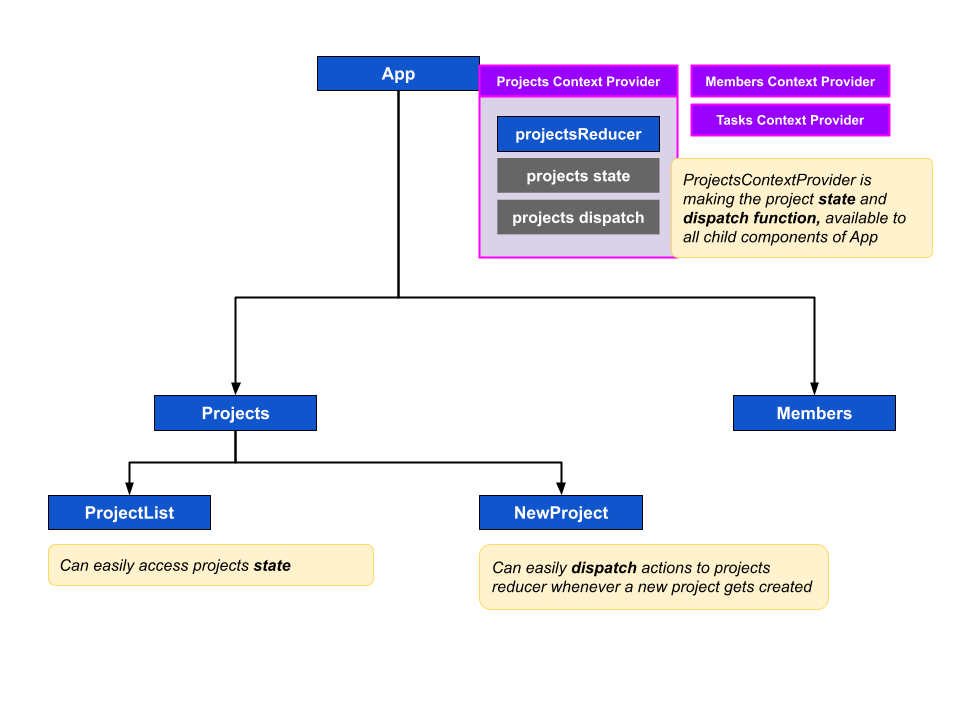

# Script
This lesson is going to be very crucial, we in this lesson we will decide which information we will keep in application state and how? So let's get started.

### The Problem
Currently in our Smarter Tasks application, after login we've only one module: Projects. In projects page, we've two features:
1. Create new project
2. Listing all projects

Now, to list down all projects, we've used the `useReducer` hook in the `ProjectList` component. 
> Action: Keep this file open: (src/pages/projects/ProjectList.tsx). As it will be helpful to explain.

As part of the implementation, we've also defined a `reducer` function, using which we're changing the state for different action types, like: `API_CALL_START`, `API_CALL_END` and `API_CALL_ERROR`. And in this component, we've also defined a `fetchProjects` function, which is making API call to the `GET /projects` endpoint and dispatching different action types depending on success or error conditions.

Now, there are no problem with `ProjectList` component and the projects page is also working es expected. 

But this implementation have certain challanges:
1. What if, in another component we need the list of projects? In that case, we've to copy the whole implementation of `useReducer` and `fetchProjects` to that component as well.
2. And what if, we want to update the list of projects from another component or on a specific event? For example, do you remember the use-case, when we created a new project and that project was not showing up in the list until we did a manual refresh?

### The Solution
To address these challenges, we need to rethink our state design. In the context of the **"App State vs Component State"** lesson, we can identify that the information managed by the projects page, is a perfect candidate to be elevated to the application-level state. By doing so, we can overcome the limitations of duplicating code, and ensure that updates to the project list are reflected consistently throughout the application.

So, the plan is: we will move the *project reducer* and *actions* to the top-level, and then we will make the *projects `state`* and *`dispatch function` to update the state*, available throughout the application using the Context API. 



So, as you can see in the diagram, we will create a `Projects Context Provider` and using it we will make the projects state and dispatch function available to the all child components of App component.

### The Implementation Plan
To design our application state, we will follow this folder structure:

1. Inside the `src` folder, we already have a `context` folder. As we are going to use the **Context API** to handle the applicatoin state, we will use this `context` folder as home to our app-level state.
2. Inside the `src/context` folder, we will create sub-folders for different modules. For example, now we are dealing with projects, so we will create a folder called `projects`. Whenever we will work with, say, `members` or `tasks`, we will create separate folder for that as well.
> Action: Create folder `projects`, inside the `src/context` folder
3. Inside the `projects` folder, first we will create a new file called `reducer.tsx`. We will use this folder to move the `reducer` function from the `ProjectList` component, to this file.
> Action: Create new file `reducer.tsx`, inside the `src/context/projects` folder
4. Then, in the `projects` folder, we will create a new file called `actions.ts`. We will use this file to move our `fetchProjects` function from the `ProjectList` component, to this file. The purpose of moving the `fetchProjects` function to this file is to make this function gobally available for other components.
> Action: Create new file `actions.ts`, inside the `src/context/projects` folder
5. Next, we will create a `context.tsx` file inside the `projects` folder to define a `ProjectsProvider` component. This component will help us to make the projects `state` and `dispatch` function available to it's child components using the Context API.
6. We can follow this same folder for other modules like: members, tasks etc.

And finally, in our `App` component, we will wrap all of our routes with this new `ProjectsProvider` component. Like this:

```tsx
return (
  <div className={`h-full w-full mx-auto py-2 ${theme === "dark" ? "dark" : ""}`}>
    <ProjectsProvider>
      <RouterProvider router={router} />
    </ProjectsProvider>
  </div>
)
```

So, our plan is ready, let's jump into the implementation.