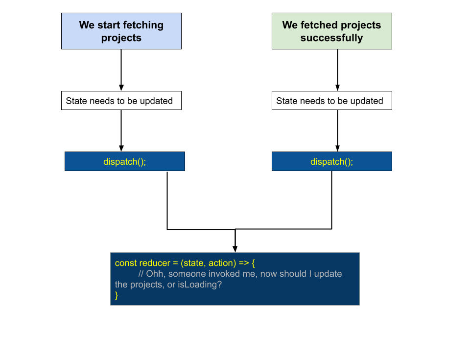
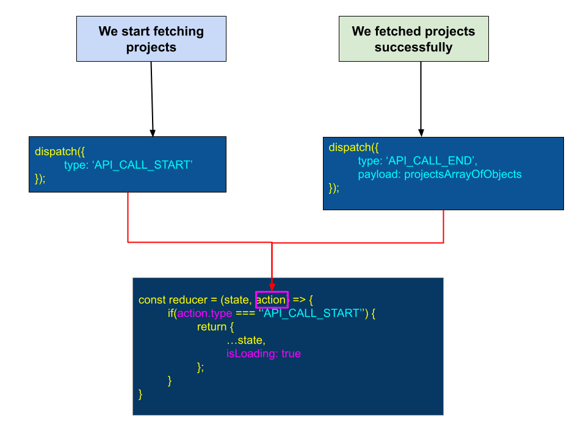

# Script
In this lesson, we will learn about one last important topic around reducer function, and it's about the **action** object. So, let me start with a problem statement.

Inside of our component, there are many different things or events can happen, when we need to update our state. We may need to update our state on the first render of our component, or may on a button click, or maybe when user types something in an input field. And with every one of those interactions, we need to update our state in some way. Because we are making use of the userReducer, the only way that we can update our state is by calling `dispatch`.



Say for our `ProjectList` component, when user loads the component for first time, we've to make the API call to get the list of projects. Now, when we've designed our state for this component, we kept a `isLoading` property, to track the API call progress. Means, the API call is a network request, which might take a few seconds to complete. In the meantime, I want to show a progressbar or say a simple **loading...** text to the user. Now to implement that, somehow I have to update the `isLoading` property of our state object. So, when the API call would start, the `isLoading` would be `true`, and when the API call ends, the isLoading would be `false`, right? 
In both cases, we've to call `dispatch()`, to update our state. And when we call dispatch(), our `reducer` function is going to get executed. And now here is the problem. When the `reducer` function runs, the only thing that the `reducer` function knows, is the input that we provide to it, means the only information it has access to, are the arguments i.e. `state` and `action`. That's it. Nothing else.

And so inside of the `reducer` function, how do we figure out, for which event we are trying to update the state? Whether we are calling `dispatch` function, before or after the API call?

So, we need some way to tell the `reducer`, why it is being executed and what piece of state it needs to update?

So to to solve this, let me show you a very popular solution:

### The `action` object
So whenever we call `dispatch`, we need to pass some information into the reducer to tell the reducer how the state should be updated. We need to tell the `reducer` if it should update the `isLoading` property or if it should update `projects` property.

Now, there are many, many different ways that we could solve this problem. But let me show you one very simple and popular one. So the solution is:
- Whenever we call `dispatch`, for example on API call start or end event, we are going to pass an object, which we would refer as an action object.
```js
dispatch({
  type: 'API_CALL_START'
})
```
- An action object is always going to have a `type` property, that is a string. So, in this case, we got the `type` property which is set to `'API_CALL_START'`.  That string in particular, is going tell the reducer what kind of state update it needs to make. Means, depending on this text, the reducer needs to update it's property. For example, say for this type `'API_CALL_START'`, the reducer may only update the `isLoading` proeprty, and set the value to `true`.
- And if we ever need to communicate some **data** to the `reducer`, such as the list of projects that we would get from the API call, then we are going to communicate that data on the `payload` property of this action object, like this:
```js
dispatch({
  type: 'API_CALL_START',
  payload: projectsArrayOfObjects
})
```

### How reducer handles the `action` object
So, now let me show you what we're going to do on the `reducer`.


> Action: Now we will explain the disgram.

So, as you can see, here we are dispatching two types of action objects. One with type `'API_CALL_START'` and another with type `'API_CALL_END'` with some value in payload.

So these action objects, which we are passing from here as the first argument into `dispatch`, are going to showup as the second argument (i.e. `action`) in the `reducer` function. So then inside of a reducer, whenever it runs, we're going to take a look at the `type` property of this `action` object.

In particular, we're going to set up a series of **if statements**, to determine what kind of state property we want to update. So here we will do a direct string comparision of the `type` preoperty to update and return a new state object.
```js
const reducer = (state, action) => {
  if (action.type === "API_CALL_START") {
    return {
      ...state,
      isLoading: true
    };
  }	
  if (action.type === "API_CALL_END") {
    return {
      ...state,
      isLoading: false,
      projects: action.payload
    };
  }	

  return state;
}
```
And for a perticular action type, for example "API_CALL_END", where we have to update the `projects` property, we can access and use the `payload` property, which is coming with the action object.

So that's it. That's the solution. That's how we're going to tell the `reducer`, exactly what kind of update to our state it needs to make. 

### Ok, now let's try implement this inside our `ProjectList` component.

