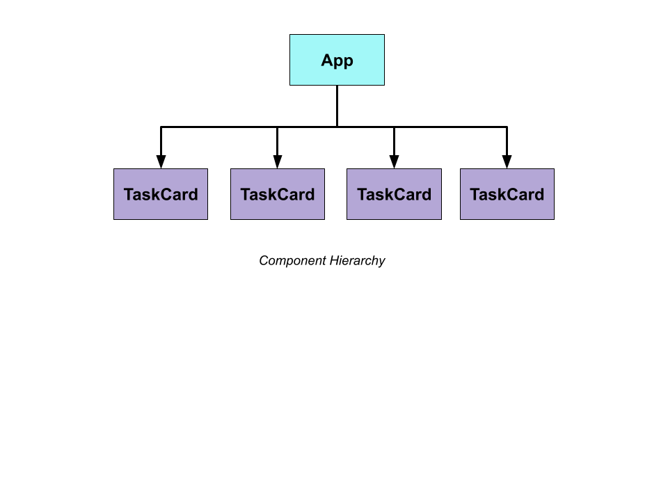

# Script
In this lesson, we will learn about *component hierarchy* or *component nesting*.

So currently in our React application, we have a `App` component which has four copies of `TaskCard` component. So the diagram of the entire layout/hierarchy of components would look something like this:


So, the `App` is showing four copies of `TaskCard`. We might refer the `App` component as a parent component and the `TaskCard` as children of the `App`.

So, a nested component is any child component linked to a parent component. This relationship between the child and parent components is formed through composition, rather than inheritance.

Even though component nesting helps you structure your code much cleaner, if you do not do component nesting correctly, you’ll end up with much more complex and less efficient code.

### Let's start the implementation
So, inside of our `src` folder, we're going to have three files in total.

1. First, we have the `index.js` file that will still be responsible for initially setting up our project and getting some content on the screen.
2. Then, we'll have the `App.js` file to create the app component. 
3. And a `TaskCard.js` file as well. That's going to create a single card.
   
So, we will start with writing the TaskCard component.
```js
const TaskCard = () => {
  return (
    <div>
      <h2>title is....</h2>
      <p>Due on: ...</p>
      <p>Assignee: ...</p>
    </div>
  );
}

export default TaskCard;
```

Then, we will import and use the `TaskCard` component inside the `App` component:
```jsx
import TaskCard from "./TaskCard";

const App = () => {
  return (
    <div>
      <div>
        <h1>Pending</h1>
        <TaskCard />
        <TaskCard />
        <a href="#!">New Task</a>
      </div>
      <div>
        <h1>Done</h1>
        <TaskCard />
        <TaskCard />
      </div>
    </div>
  );
}

export default App;
```
> Action: Open browser and show the output

Now, as you can see, every card is showing the same data, and we've to fix it.
