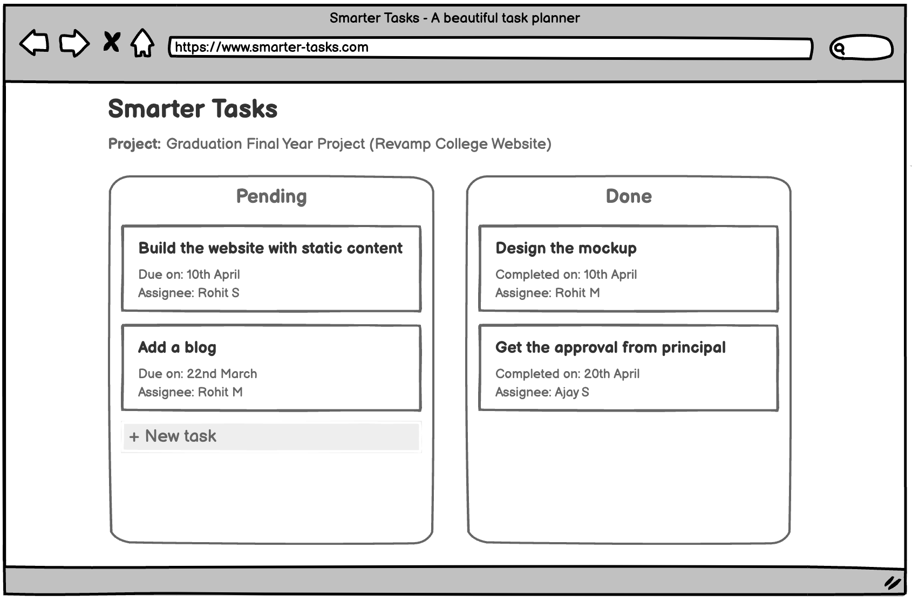

# Text
From this lesson onwards, we are going to actually write some code to create some React components, so let's get started.

# Script
To start working on our React app, let me first show a simple mockup of the application that we are going to build in the next few lessons.



This might look like a very, very simple project, but believe me, there are a ton of complexity hidden there.

So, we are going to build a simple task planner, where we have a project and there are multiple tasks inside it. The tasks are separated in two categories like `Pending` for pending tasks and `Done` for completed tasks. Inside these two categories, we have multiple tasks with `Title`, `Due date` and `Assignee`.
And that's it. That's the entire app.

Now, as soon as you look at this mock-up, you might start to realize that we've got some duplicated looking content here.

> Action: In mockup show the task card

Here, the text contents are different, but the general structure or layouts of these cards appears to be kind of identical.

Any time inside a React project that you see different elements that look just about identical, that's usually a sign that you're going to be able to create a **reusable component**. This is going to save you a lot of time on your projects, and it's going to make it a lot easier for you to build projects very quickly.

So that's going our focus for next few lessons.
### How do we make reusable components and how do we build an app out of them?

Now, thinking about how to approach this project, I want to point out two different options on how we can really just write out the code for this entire thing.

The first option is probably not going to work out too well, but I just want to show it to you.

Here inside our `App` component, we can write out all the JSX required to show the task card *Build the website with static content*, and then duplicate all that, to show all the JSX for *Add a blog* and duplicate it again, to show all the tasks of *Done* category as well.

```jsx
const App = () => {
  return (
    <div>
      <div>
        <h1>Pending</h1>
        <div>
          <h2>Build the website with static content</h2>
          <p>Due on: 10th April</p>
          <p>Assignee: Rohit S</p>
        </div>
        <div>
          <h2>Add a blog</h2>
          <p>Due on: 22nd March</p>
          <p>Assignee: Rohit M</p>
        </div>
        <a href="#!">New Task</a>
      </div>
      <div>
        <h1>Done</h1>
        <div>
          <h2>Design the Mockup</h2>
          <p>Completed on: 10th April</p>
          <p>Assignee: Rohit S</p>
        </div>
        <div>
          <h2>Get the approval from principal</h2>
          <p>Completed on: 22nd March</p>
          <p>Assignee: Rohit M</p>
        </div>
      </div>
    </div>
  );
}
```

So in this case, we've created a lot of duplicated JSX. This is probably not a good approach, because let's imagine that for some reason maybe I want to change the `h2` element that displays the task title, to an `h1` or `h3`.  In that case, I have to update each and every task cards to keep the interface same. And that would be a tedious job.

So, maybe there is a better way to approach. Naturally, there is.

**Option 2:**
We're going to make a single reusable component that's going to show one single card.
So we'll have a component called something like `TaskCard`, and that's going to return some basics that will show just one single task details.
```jsx
const TaskCard = () => {
  return (
    <div>
      <h2>title is....</h2>
      <p>Due on: ...</p>
      <p>Assignee: ...</p>
    </div>
  );
}
```

Then we're going to reuse that single component multiple times inside our `App` component.
```jsx
const App = () => {
  return (
    <div>
      <div>
        <h1>Pending</h1>
        <TaskCard />
        <TaskCard />
        <a href="#!">New Task</a>
      </div>
      <div>
        <h1>Done</h1>
        <TaskCard />
        <TaskCard />
      </div>
    </div>
  );
}
```
And that's going to cause four different TaskCards to show up on the screen. 
Now there is one kind of missing piece of the puzzle here, something that we've to figure out. I'm saying that we're going to reuse this component multiple times, but wouldn't that just mean that we're going to show duplicated content? 

Yeah, it would.

So we've to figure out some way to somehow customize what `title` or `due date` or `assignee` data that is shown inside of each of these four components.

But that is a scope of another lesson, and I'll explain it in detail. See you there.
