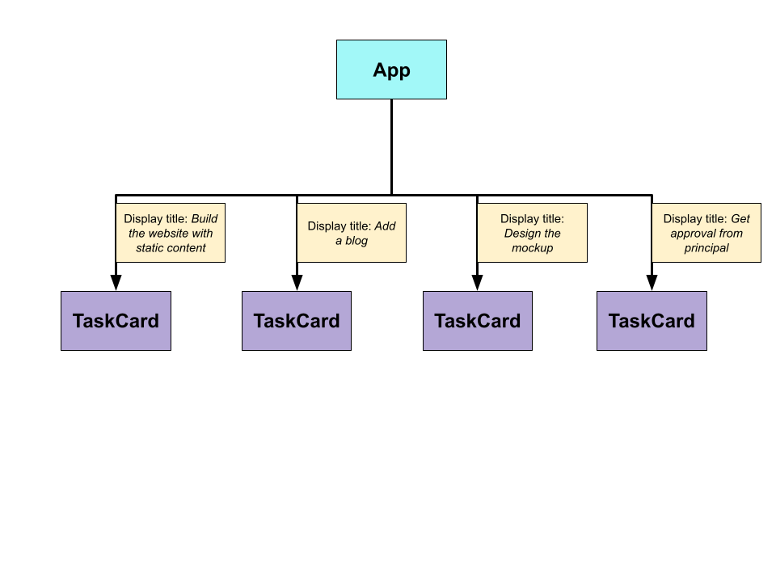

# Script
In this lesson, we will learn about a very important concept in React called `props`.

So, we will start with our application. 

>Action: Open the app in browser

Here we're showing four different copies of `TaskCard`, but the content inside them are completely identical. And we've to figure out a way to customize each instance of *TaskCard* that we are displaying.

Let's consider this diagram for now:


So, the `App` component have to send different *titles*, *due dates* and *assignee names* to the `TaskCard` component. So the `App` needs to somehow take this information and communicate that down, into each copy of *TaskCard*.

To communicate from a parent component down to a child component, we use something called the **props** system.

Using the props system, we can send some data from the parent component to the child component. The data is sent as an **object**, that we refer as `props`. Then the child component can use that props object in some way, to customize itself.

So in our case, we can send the task *title*, *due date*, *assignee name*, and *completion date* to the `TaskCard` as props object.

One important point to note here is that, in props system, data flows in one direction. Means you can only send data as props, from parent to child component, not the opposite way.

Now, let's go back to VS code and try to send some data from `App` component, to the `TaskCard` component.
```jsx
const App = () => {
  return (
    <div>
      <div>
        <h1>Pending</h1>
        <TaskCard title="Build the website with static content" />
        <TaskCard />
        <a href="#!">New Task</a>
      </div>
      <div>
        <h1>Done</h1>
        <TaskCard />
        <TaskCard />
      </div>
    </div>
  );
}
```
Here, we've added an attribute called `title`, which equals to **"Build the website with static content"**. And, I want to communicate this data to the child component, `TaskCard`.

Now, React is going to collect all the attributes we've added to this JSX element here, and it's going to stuff them all into an object.

So in this case, we added in one attribute to set `title` equals *"Build the website with static content"*. React is going to put it into an object as a key value pair.

```js
{ title: "Build the website with static content" }
```

Next, React makes the same exact props object available as the first argument into our child component function, i.e `TaskCard`.

```jsx
const TaskCard = (props) => {
  console.log(props)
  return (
    <div>
      <h2>title is....</h2>
      <p>Due on: ...</p>
      <p>Assignee: ...</p>
    </div>
  );
}
```
Once we receive that object, we can use whatever data is there inside it, in any manner. So, let's try to print the `title`.

```jsx
const TaskCard = (props) => {
  return (
    <div>
      <h2>{props.title}</h2>
      <p>Due on: ...</p>
      <p>Assignee: ...</p>
    </div>
  );
}
```
>Action: Open browser and show output

And yes, it works!
So that's all about the props system.