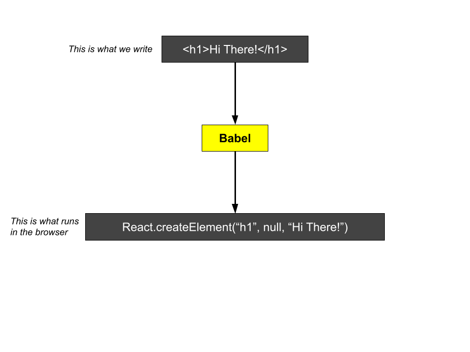

# Script
JSX stands for Javascript XML and it is a very useful tool for React developers. JSX is an extension of the JavaScript language which provides a way to structure component rendering using syntax similar to HTML.

Inside of our `App` component that we created just a moment ago, we returned a JSX element.
```jsx
  return (
    <h1>Hi There!</h1>
  );
```
In this lesson we will focus on JSX to really understand what it is all about.

As I've mentioned before, JSX is what we write out inside our component to tell React what we want to show on the screen. And as I've also mentioned that, the JSX that we write inside of our editor is not actually gets executed inside the browser. Because it's not valid JavaScript and your browser doesn't have any idea what JSX is.

So even though you and I write out some JSX inside of our editor, it's going to be passed through a tool called BABEL and translated into some equivalent JavaScript.

If we ran the statement `<h1>Hi there!</h1>`, through that BABEL tool, we would get back a little snippet of JavaScript that looks like this.



So this statement is 100% equivalent to the `h1` up here. It's just the translated form.

So remember, JSX can really be thought of as like a very small instruction that we pass to React, to tell it, what kind of element we want to display on the screen.

To understand it better, let's visit a websaite called: https://babeljs.io/repl
> Action: Visit the webasite and show the same <h1> tag

Inside our component, we're going to write JSX snippets like this, 
```jsx
  <h1>Hi There!</h1>
```
But just writing out a JSX element doesn't get anything to show up automatically inside the browser. In order to actually make use of a JSX element, we have to *return* it from a component.
```jsx
  return (
    <h1>Hi There!</h1>
  );
```
So that's just a little bit of basics on what JSX is and why we use it. In upcoming lessons, we're going to explore some more greater detail to really start to understand its syntax and some corner cases.