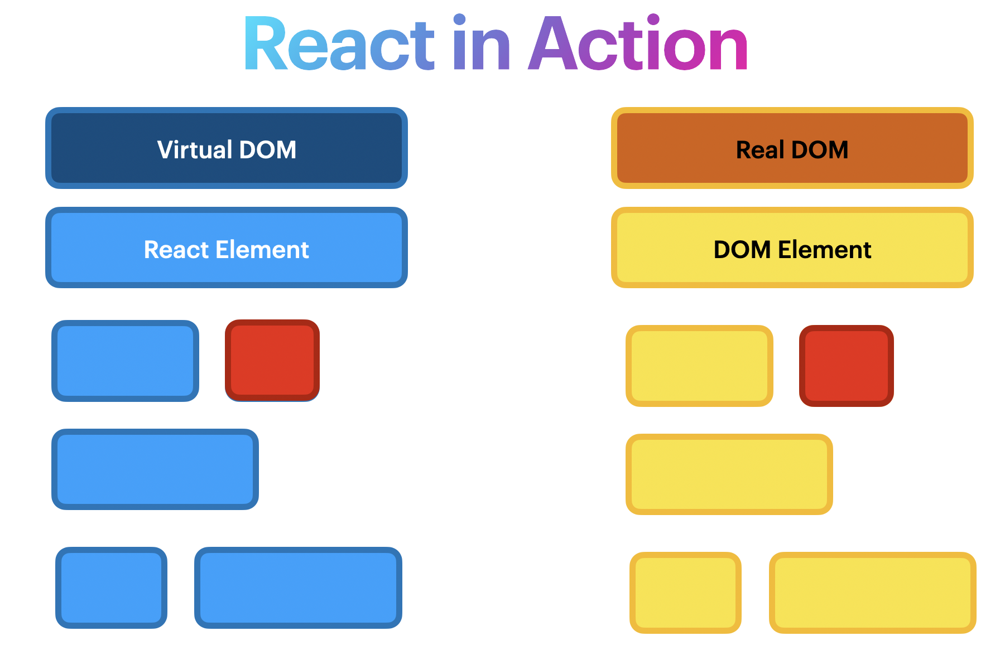

# Script
In this lesson, we will learn about a concept called Virtual DOM, which React uses under the hood. The virtual DOM is a fundamental React concept and I wanted to give you a brief introduction of it. So, let's get started.

First, we will start with DOM.

### What is DOM? And how we can manipulate it?
Normally, whenever a web page is requested by a user, the browser receives an HTML document for that page from the server. The browser then constructs a logical tree-like structure from the HTML for the user to see the requested page in the client.

This tree-like structure is called the Document Object Model, also known as the DOM. It is a structural representation of the web document — in this case, an HTML document — as nodes and objects.

Developers can use the DOM APIs to add or remove elements, modify their appearance, and perform user actions on the web elements.

DOM operations are lighter operations and very fast. However, when the app data changes and triggers an update, re-rendering can be expensive.

#### How re-rendering impacts performance

For example, when we do
```js
document.getElementById('elementId').innerHTML = "New Value"
```
Following thing happens:

1. The browser has to parse the HTML.
2. It removes the child element of `elementId`.
3. Updates the DOM with the “New Value”.
4. Re-calculate the CSS for the parent and child.
5. Update the layout i.e. each elements exact coordinates on the screen/
6. Traverse the render tree and paint it on the browser display.

Recalculating the CSS and changing layouts uses complex algorithms and they affect the performance. Thus updating a real DOM does not involve just updating the DOM but, it involves a lot of other processes. This is why updating Real DOM is slow.


### What is Virtual DOM?
As the name implies, virtual DOM is a “virtual” representation of the actual DOM. By virtual, we mean a much lighter replica of the actual DOM — in the form of objects — that can be saved in the browser memory.

React deploys the concept of virtual DOM in the rendering process because it uses a declarative approach.

This approach lets us specify, what state we want the UI to be in, after which React makes it happen. It abstracts manual DOM manipulations away from the developer, helping us write more predictable code, so we can focus on creating components.

The virtual DOM allows developers to not worry about state transitions. Once we update the state, React ensures the DOM matches that state.

> Action: Show the animation how Virtual DOM works

